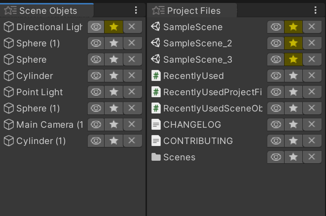

# RecentlyUsed

Editor extension that keeps track of recently selected project files or scene gameobjects.

* sorted by selection count but can also be pinned on top
* works with single or multiple scene
* data is serilized with JsonUtitlity and saved to "Application.persistentDataPath".

